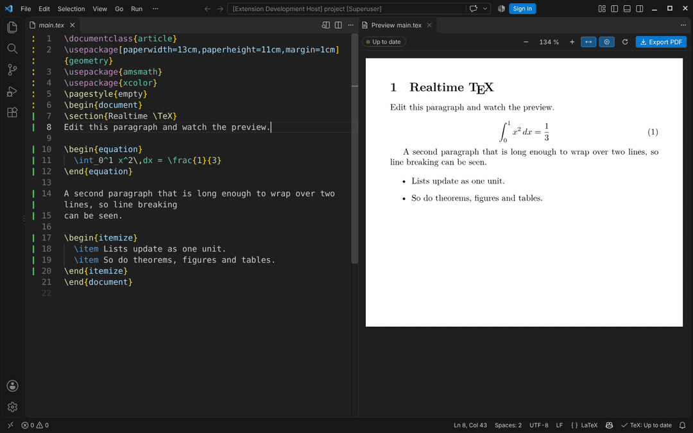

# realtime-tex (rtex)

[English](README.md) | 简体中文

**边打字边看到 LaTeX 文档更新，大约一毫秒，而且始终是 LuaLaTeX 的排版结果。**



rtex 是一个供编辑器使用的库。你输入时，它只重新排版你正在编辑的那个段落：用的是一个已经加载好导言区的
LuaLaTeX 进程，然后把排好的新行交给编辑器绘制。完整编译在后台进行，负责真正全局性的内容：分页、浮动体、
目录、交叉引用和参考文献。

结果与 LuaLaTeX 的输出完全一致：同样的断行、同样的字形，位置精确到 1/65536 pt。rtex 使用 TeX Live
中未经修改的 LuaTeX，导出的 PDF 与普通的 LuaLaTeX 编译结果完全相同。

```
                         ┌─▶ 实时引擎 ────▶ 该段落的新行            （约 1 ms）
 按键 ─▶ rtex ───────────┤
                         └─▶ 后台编译 ────▶ 整页、交叉引用、目录    （停止输入后几秒内）
```

这一方法源自 Clemens Lode 的论文 [*Real-Time LuaTeX: Recompiling Large Documents in 1 ms*](https://www.tug.org/tug2026/preprints/lode-realtime.pdf)
（TUG 2026）。

## 在 VS Code 中使用

使用 rtex 最简单的方式是 VS Code 插件
**[Realtime TeX Live Preview](https://github.com/HenryXiaoYang/realtime-tex-vsc-plugin)**。它在编辑器旁显示实时预览，
并在首次使用时自动为你安装 rtex（需要时还会安装一个精简版 TeX Live）。打开一个 `.tex` 文件，点击编辑器标题栏上的
预览图标（或按 Ctrl+Alt+V，Mac 上为 Cmd+Alt+V），然后开始输入即可。插件在 Linux、macOS 和 Windows 上原生运行 rtex，并会为你的平台下载预编译的引擎。

本页其余部分介绍 rtex 本身，也就是该插件所基于的库。

## 有多快

从按键到编辑器拿到更新后的段落所需的时间（300 次编辑的中位数，测试机器为 4 核云虚拟机；普通笔记本电脑通常更快）。
[完整基准测试](docs/benchmarks.md)。

| 段落 | 10 页文档 | 100 页 | 300 页 |
|---|---|---|---|
| 一行 | 0.50 ms | 0.48 ms | 0.61 ms |
| 四行 | 1.04 ms | 1.10 ms | 1.18 ms |
| 十行 | — | 2.39 ms | 1.94 ms |
| 列表、图、表、行间公式 | 1.4–1.9 ms | 1.5–1.7 ms | |

耗时与文档长度无关，只取决于段落本身。字体设置也有影响：使用 fontspec 默认的 OpenType 字形处理时，
长段落的耗时最多可达 TFM 字体或 `Renderer=Basic` 的 4–5 倍（[原因](docs/live-editing.md#making-it-faster)）。

在同一份文档中编辑一个段落：rtex 需要 1.3–1.6 ms，Typst 0.15.1 需要 18 ms（10 页）到 414 ms（300 页），而一次完整的 LuaLaTeX 编译需要 0.5–1.7 s。Overleaf 每次重新编译都要重复这样一次完整编译（[对比](docs/benchmarks.md#compared-with-typst-and-overleaf)）。

## 哪些内容会实时更新

正文、公式（行内和行间，`align` 等）、交叉引用和文献引用、列表、定理、图表、标题、脚注标记、你自己定义的宏和环境，
以及大多数宏包。如果 rtex 无法证明某个实时结果是精确的，它会说明原因，该段落改为在下一次后台编译后更新。
这包括导言区的修改、目录、边注，以及输出依赖于页面状态的文本。[完整列表](docs/live-editing.md)。

## 安装

每个 [release](https://github.com/HenryXiaoYang/realtime-tex/releases/latest) 都附带预编译的二进制包，支持
Linux（x86_64、arm64）、macOS（Apple 芯片、Intel）和 Windows（x86_64）。每个压缩包包含 `rtex` 命令、C 库和头文件，
以及 rtex 的 TeX 支持文件。解压到任意位置后运行 `bin/rtex doctor`，即可检查 rtex 能否找到它的文件和你的 LuaLaTeX。
你仍然需要带 LuaLaTeX 的 TeX Live，精简版的安装方法见下文。

```sh
# Linux x86_64；其他压缩包为 rtex-aarch64-unknown-linux-gnu.tar.gz、
# rtex-aarch64-apple-darwin.tar.gz、rtex-x86_64-apple-darwin.tar.gz、rtex-x86_64-pc-windows-msvc.zip
curl -L https://github.com/HenryXiaoYang/realtime-tex/releases/latest/download/rtex-x86_64-unknown-linux-gnu.tar.gz | tar -xz
rtex-*/bin/rtex doctor
```

## 从源码动手试试

你需要 [Rust](https://rustup.rs) 和带 LuaLaTeX 的 TeX Live。下面的脚本会把一个精简版 TeX Live 安装到
`build/texlive`（大约 15 分钟；在 Windows 上请在 Git Bash 中运行）。也可以使用已有的 TeX Live 或 MacTeX：
把 `RTEX_TEXLIVE_BIN` 设为它的 `bin` 目录即可。

```sh
git clone https://github.com/HenryXiaoYang/realtime-tex && cd realtime-tex
scripts/install-texlive.sh && source build/texlive.env
cargo build --release

# 生成一本 10 页的测试书，做一次实时编辑，并打印返回的结果
target/release/rtex gen-book --pages 10 --out build/fx/book-10
target/release/rtex edit --project build/fx/book-10 --find "Baseline export" --text " (edited)"

# 检查实时输出与真实 PDF 是否一致，然后导出
target/release/rtex verify --project build/fx/book-10
target/release/rtex export --project build/fx/book-10 --out build/book-10.pdf --check
```

要实时编辑你自己的文档，可以使用 [VS Code 插件](https://github.com/HenryXiaoYang/realtime-tex-vsc-plugin)，
或者自己运行 `rtex serve --project path/to/your/project` 来驱动一个会话（通过 stdin/stdout 收发 JSON 行）。

## 集成到你自己的编辑器

rtex 可以作为 Rust crate、C 库（`include/rtex.h`）或以 JSON 行通信的子进程来使用。编辑器发送编辑操作，
接收事件，例如“这个段落现在是这样的”和“这是新的页面”。每个事件都附带显示列表（display list）：
来自字体文件的字形及其精确位置，可以直接绘制。包含显示列表无法描述的内容（例如 TikZ 图形）的页面，
会附带一个 PDF 供绘制使用。详见[嵌入指南](docs/embedding.md)；
[VS Code 插件](https://github.com/HenryXiaoYang/realtime-tex-vsc-plugin)就是一个完整的宿主示例。

## 平台

支持 Linux、macOS 和 Windows。CI 在这三个平台上用真实的 TeX Live 运行测试。只支持 LuaLaTeX
（不支持 pdfLaTeX 和 XeLaTeX），需要 2021 年或更新的 LaTeX 内核。

## 文档

以下文档目前只有英文版。

| | |
|---|---|
| [Live editing](docs/live-editing.md) | 哪些内容随输入更新、哪些需要等待、如何让它更快 |
| [How it works](docs/how-it-works.md) | 实时引擎、后台编译，以及 rtex 如何判断哪些内容可以实时更新 |
| [Embedding](docs/embedding.md) | Rust、C 和 JSON 行接口，事件、配置、绘制 |
| [Display lists](docs/display-list.md) | 绘制格式（二进制和 JSON） |
| [Correctness](docs/correctness.md) | 如何对照 LuaTeX 及其 PDF 检查输出，以及当前结果 |
| [Benchmarks](docs/benchmarks.md) | 延迟、后台编译、字体，以及与论文的对比 |
| [Engine protocol](docs/engine-protocol.md) | rtex 如何与实时 LuaTeX 进程通信（面向贡献者） |
| [Development](docs/development.md) | 构建、测试、CI、排查引擎故障 |
| [Changelog](CHANGELOG.md) | 更新日志 |

## 状态

当前版本 0.0.2。它可以正常工作并经过测试，但 API、C ABI 和显示列表格式在 0.1 之前仍可能变化。

## 许可证

MIT，见 [LICENSE](LICENSE)。`bench/upstream/` 中收录的论文基准测试保留其自己的 MIT 许可证。

## 致谢

- Clemens Lode（[@ClemensLode](https://github.com/ClemensLode)）：本项目所基于的论文
  [*Real-Time LuaTeX: Recompiling Large Documents in 1 ms*](https://www.tug.org/tug2026/preprints/lode-realtime.pdf)
  （TUG 2026）的作者。
- [@kenny-21342](https://github.com/kenny-21342)。
- [LuaTeX / LuaLaTeX](https://www.luatex.org/) 的开发者：rtex 直接使用他们未经修改的引擎。
- [Typst](https://github.com/typst/typst)：它让人看到排版可以有多快。
- [LINUX DO](https://linux.do/) 社区。
